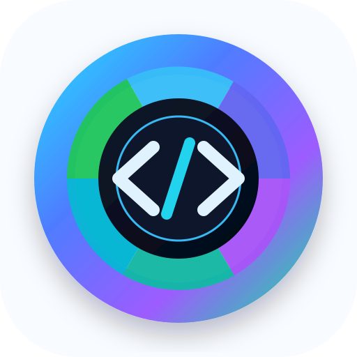
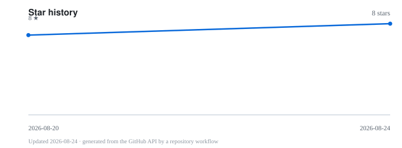

<p align="center"></p>

<h1 align="center">opencode-chromium</h1>

<p align="center"><strong>Provider-neutral Chromium automation for MCP clients, OpenCode V2, Codex, and direct JavaScript agents.</strong></p>

<p align="center">
  <a href="https://github.com/Quindart-com/opencode-chromium/stargazers"></a>
  <a href="https://github.com/Quindart-com/opencode-chromium/discussions"></a>
</p>

<p align="center">
  <a href="https://github.com/Quindart-com/opencode-chromium/stargazers"></a>
</p>

## Community and roadmap

The roadmap is shaped by users — open a proposal, upvote with reactions, and
follow announcements on
[GitHub Discussions](https://github.com/Quindart-com/opencode-chromium/discussions):

- **Feature requests** — start a proposal (the template keeps it structured):
  describe the problem and the workflow it should unlock; others vote with
  👍/❤️ reactions. The maintainers triage voted proposals into upcoming work
  and tag them with their status (`planned`, `in progress`, `released`).
  [Open a proposal →](https://github.com/Quindart-com/opencode-chromium/discussions/categories/feature-requests)
- **Announcements** — releases, roadmap status, and maintainer notes.
  [Follow announcements →](https://github.com/Quindart-com/opencode-chromium/discussions/categories/announcements)
- **Protocol** — feature requests concern what this repository publishes
  (runtime, extension, native host, skills); bug reports and security findings
  belong in GitHub Issues instead.

## What it provides

- Four compact default tools: `browser_run`, `browser_observe`, `browser_session`, and `browser_finalize`.
- The complete multi-operation browser engine behind explicit compatibility and capability modes.
- Context-lean evidence: observation summaries omit empty fields, duplicate text, and verbose `html`/`styles` (available only through `detail: "debug"`), and inline responses stay within the 4,096-character budget with oversized output spilled to artifact resources.
- Native hover, JavaScript dialog handling with approval gating, and png/jpeg/webp screenshots with quality control.
- Non-intrusive background automation: clicks, typing, and navigation never activate the tab or bring its window forward, so you can keep working while the tool drives a background tab.
- Server-level origin policy (allowed/blocked origin globs) and file-root restrictions for uploads.
- Persistent session emulation (viewport, network, CPU, geolocation, color scheme, user agent, headers, init scripts) with automatic reset on finalize.
- Network request drill-down by requestId with artifact-backed body spillover, and source-mapped console stack traces.
- Performance diagnostics: `browser_observe` mode `diagnostic` records CDP traces and computes LCP, CLS, long tasks, TBT, and more in the native host; raw traces are artifact-first and CrUX/field data stays off.
- Snowflake-default page search with explicit lexical/auto alternatives and Qwen deep retrieval without loading models in the extension.
- Profile-aware sessions, tab ownership, stale-target recovery, bounded read retries, conditional settling, approvals, and artifact resources.
- MCP stdio and loopback/ authenticated HTTP transports with protocol-clean stdout.
- A native OpenCode V2 adapter and shared OpenAI, Anthropic, Gemini, and MCP schema adapters.

## Quick start (npm)

Install the published package once, then connect any supported client. The
package ships the CLI (`opencode-chromium`), the MCP server bin
(`opencode-chromium-mcp`), the browser extension, and the native host
installer:

```powershell
npx -y opencode-chromium-mcp
```

| Client                  | Surface                    | Setup                                                                 |
| ----------------------- | -------------------------- | --------------------------------------------------------------------- |
| OpenCode V2             | Native plugin              | `"plugin": ["opencode-chromium"]` in `opencode.json`                  |
| Codex                   | MCP server (stdio)         | `codex mcp add opencode-browser-plugin -- npx -y opencode-chromium-mcp` |
| Any MCP client          | MCP server (stdio)         | `npx -y opencode-chromium-mcp` as a stdio server |
| Direct JavaScript       | SDK (`opencode-chromium/sdk`) | `import { createAgentBrowserRuntime } from "opencode-chromium/sdk"` |

### 1. Install the package

```powershell
npm install -g opencode-chromium
```

### 2. Load the browser extension

> **[Install opencode-chromium from the Chrome Web Store](https://chromewebstore.google.com/detail/opencode-chromium/hdljmmpfnhojebplbbgdgejoobmjcbml?authuser=0&hl=en).** The unpacked flow below remains available for development and local testing.

Open `chrome://extensions`, enable Developer mode, and load the unpacked
`extension/` folder from the installed package:

```powershell
npm root -g
# load "<that path>\opencode-chromium\extension" as an unpacked extension
```

The extension ID is derived from the load path, so keep the folder where it
is. Note the ID shown in `chrome://extensions`.

### 3. Install the native messaging host

```powershell
node "$(npm root -g)/opencode-chromium/scripts/install-native-host.js" --extension-id <extension-id> --browsers chrome
```

### 4. Connect a client

OpenCode V2 — add the package name to the global
`~/.config/opencode/opencode.json`:

```json
{
  "$schema": "https://opencode.ai/config.json",
  "plugin": ["opencode-chromium"]
}
```

Codex — register the required MCP server:

```powershell
codex mcp add opencode-browser-plugin -- npx -y opencode-chromium-mcp
```

Any MCP client — add the stdio server:

```json
{
  "mcpServers": {
    "opencode-browser-plugin": {
      "command": "npx",
      "args": ["-y", "opencode-chromium-mcp"]
    }
  }
}
```

Direct JavaScript — import the SDK runtime or the MCP server programmatically
(see [docs/direct-sdk.md](docs/direct-sdk.md)).

### 5. Verify

```powershell
opencode-chromium doctor --json
opencode-chromium verify
```

All four tools (`browser_run`, `browser_observe`, `browser_session`,
`browser_finalize`) are then available in every connected client. Do not
enable both the native OpenCode adapter and the MCP server in one client
session unless duplicate tools are intentional.

## Requirements

- Node.js 20 or newer for the npm package and SDK.
- Bun 1.1 or newer when building from source or running the repository scripts.
- A Chromium-family browser with the unpacked `extension/` loaded.
- The native messaging host installed for the extension ID.

## Install and build

```powershell
bun install --frozen-lockfile
bun run build
bun test
bun run check
```

The package is released as `1.6.1` under the npm name `opencode-chromium`. The stable runtime and MCP server identity remains `opencode-browser-plugin` for client compatibility.

## MCP

Run the four-tool server over stdio:

```powershell
bun run mcp
```

Or use the packaged binary:

```powershell
opencode-chromium-mcp
```

Loopback Streamable HTTP is available with:

```powershell
bun run mcp:http
```

Non-loopback HTTP requires a bearer token in `AGENT_BROWSER_AUTH_TOKEN` (or the variable selected with `--auth-token-env`). The default server name is `opencode-browser-plugin`. Origin and file-root safety configuration is server-level: pass `--allowed-origin` / `--blocked-origin` globs, or set `AGENT_BROWSER_ALLOWED_ORIGINS`, `AGENT_BROWSER_BLOCKED_ORIGINS`, and `AGENT_BROWSER_ALLOWED_FILE_ROOTS` (see [docs/mcp.md](docs/mcp.md)).

## OpenCode V2

The package root exports the native adapter using OpenCode 1.18.x's official `{ id, server() }` path-plugin module shape, alongside the V2 setup contract:

```json
{
  "$schema": "https://opencode.ai/config.json",
  "plugin": ["opencode-chromium"]
}
```

For a local build, point the client at `dist/adapters/opencode/index.js` or
use the `opencode-chromium install --client opencode` command. The adapter
registers exactly four tools, sets `codemode: false`, and returns a cleanup
function for reloads.

The same browser runtime is available through MCP compatibility mode; do not enable both surfaces in one client session unless duplicate tools are intentional.

## Codex

Register the MCP server from the npm package:

```powershell
codex mcp add opencode-browser-plugin -- npx -y opencode-chromium-mcp
codex mcp list
```

From a local checkout, register `dist/adapters/mcp/server.js` with Bun:

```powershell
codex mcp add opencode-browser-plugin -- bun C:\absolute\path\to\dist\adapters\mcp\server.js
```

The bundled skill is [skills/opencode-browser-plugin/SKILL.md](skills/opencode-browser-plugin/SKILL.md). It follows the open [Agent Skills](https://agentskills.io) standard and covers connector-first routing, profile selection, action batching, Snowflake-default search, approval tokens, artifacts, and finalization. It ships with [agents/openai.yaml](skills/opencode-browser-plugin/agents/openai.yaml) for the ChatGPT/Codex desktop Skills picker and MCP dependency metadata.

Install it for every skills-compatible client at once:

```powershell
opencode-chromium install --client skills
opencode-chromium install --client skills --dry-run
opencode-chromium uninstall --client skills
```

This copies the skill to `~/.codex/skills/`, `~/.claude/skills/`, and `~/.agents/skills/` (under `opencode-browser-plugin/`), and registers an enabled `[[skills.config]]` entry in `~/.codex/config.toml` while removing any stale `opencode-browser-adapter` entry.

## Native host and extension

Load `extension/` as an unpacked extension, then install the host:

```powershell
bun run install:native-host -- --extension-id <extension-id> --browsers chrome
bun run check:native-host -- --json
```

Use `AGENT_BROWSER_*` environment variables for new configuration. The older `OPENCODE_BROWSER_*` names remain lower-priority aliases through the 1.x compatibility window.

## CLI

```powershell
opencode-chromium doctor --json
opencode-chromium verify
opencode-chromium install --client opencode --dry-run
opencode-chromium install --client opencode-mcp --dry-run
opencode-chromium install --client codex --dry-run
opencode-chromium install --client skills --dry-run
opencode-chromium uninstall --client codex --dry-run
opencode-chromium uninstall --client skills --dry-run
```

Install and uninstall back up the named configuration before changing it, touch only the canonical entry, support dry runs, and report changed files.

## Context and capabilities

The default tool schemas stay small. Request advanced descriptions through:

```json
{"mode":"capabilities","pack":"downloads"}
```

Execute advanced work through `browser_run` without adding top-level tools:

```json
{
  "steps": [{
    "action": "capability",
    "capability": "downloads.events",
    "input": {}
  }]
}
```

For deep request/response debugging, request the lazy network pack only when needed:

```json
{"mode":"capabilities","pack":"network"}
```

Then execute `network.inspect` in `browser_run` with the target `tabId`. It follows the tab's CDP request/response lifecycle, supports URL/method/type/status/requestId filters, and returns redacted headers only when `includeHeaders` is requested. Bodies remain disabled unless explicitly requested and approved; `bodyDelivery: "artifact"` spills opted-in bodies to the artifact store instead of inline previews. `browser_observe` mode `inspect` with `target.requestId` returns a single request's lifecycle detail.

Large results and screenshots are artifact-first. MCP clients retrieve them through `browser://sessions/<session-id>/artifacts/<artifact-id>`; OpenCode can request the same URI with `browser_observe` mode `artifact`.

## Repository layout

```text
src/core/                 shared runtime, schemas, safety, artifacts, versions
src/browser/              profile-aware IPC client, policies, and operation engine
src/adapters/mcp/         universal MCP server and transports
src/adapters/opencode/    native OpenCode V2 adapter
src/adapters/sdk/         provider schema adapters and direct agent API
src/cli/                  install, configure, uninstall, doctor, verify
extension/                Manifest V3 browser integration
native-host/              native messaging host and semantic workers
skills/                   provider-neutral browser skill
tests/                    unit, contract, browser, and adapter regression tests
docs/                     architecture, compatibility, security, and migration guides
```

## Verification and release

```powershell
bun run build
bun run check:schemas
bun run check:package
bun run check:mcp
bun run test:contracts
bun run test:opencode
bun run pack
bun run test:tarball
bun run check:release
```

The release check rejects stale V1 paths, personal state, duplicate legacy package surfaces, schema growth beyond budget, and tarballs missing the built adapters.

GitHub Actions runs the same verification on pull requests and `master` pushes. A release is published only from a matching `v*` tag through the protected `npm-production` environment using npm Trusted Publishing; no npm token is stored in the repository or workflow.

## Security

Browser content is untrusted. Consequential actions require short-lived immutable approval tokens; writes are never automatically repeated after uncertain execution. Artifacts are session scoped, expire, reject traversal, and are not written to logs. MCP protocol data stays on stdout and diagnostics stay on stderr.

See [docs/architecture.md](docs/architecture.md), [docs/security.md](docs/security.md), [docs/compatibility.md](docs/compatibility.md), and [docs/migration-1.0.md](docs/migration-1.0.md).

## License

MIT
