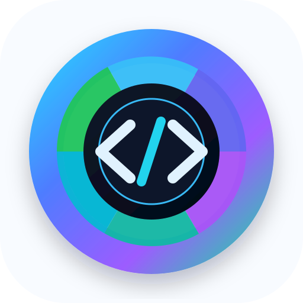
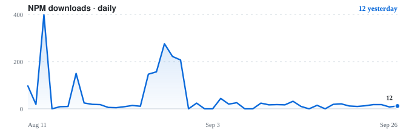

<p align="center"></p>
<h1 align="center">OpenCode Browser Plugin</h1>
<p align="center">Your browser, connected to your coding agent.<br>Four compact tools. Local action memory. Optional decision assistance.</p>
<p align="center">
<a href="https://www.npmjs.com/package/opencode-chromium"></a>
<a href="https://www.npmjs.com/package/opencode-chromium"></a>
<a href="https://github.com/Quindart-com/opencode-chromium/discussions"></a>
</p>
<p align="center">
<a href="https://chromewebstore.google.com/detail/opencode-chromium/hdljmmpfnhojebplbbgdgejoobmjcbml"></a>
<a href="https://addons.mozilla.org/firefox/addon/opencode-browser-plugin/"></a>
</p>

## Get started

Install the matching browser extension, then connect all detected supported harnesses and native hosts:

```sh
npx -y opencode-chromium@latest setup --all
```

Setup shows what changed and keeps transactional backups. Preview with `--dry-run --json`. Quit and reopen desktop harnesses, or reconnect MCP in terminal clients. For Firefox and LibreWolf, complete the [guided loopback setup](docs/firefox.md). The AMO install button becomes available after Mozilla approves the initial submission.

<details><summary><strong>Codex CLI and Codex Desktop</strong></summary>

```sh
npx -y opencode-chromium@latest setup --targets codex
```

Both use the shared Codex MCP configuration. [Codex guide](docs/codex.md).
</details>
<details><summary><strong>Claude Code</strong></summary>

```sh
npx -y opencode-chromium@latest setup --targets claude-code
```
</details>
<details><summary><strong>Claude Desktop</strong></summary>

```sh
npx -y opencode-chromium@latest setup --targets claude-desktop
```

Supported setup targets: Windows and macOS.
</details>
<details><summary><strong>OpenCode</strong></summary>

```sh
npx -y opencode-chromium@latest setup --targets opencode
```

Uses the native adapter by default and the detected version's configuration format. [OpenCode guide](docs/opencode.md).
</details>
<details><summary><strong>DeepSeek Harness</strong></summary>

```sh
npx -y opencode-chromium@latest setup --targets dsh
```

Registers MCP in the Cordis profile patch. [Harness guide](docs/universal-clients.md).
</details>
<details><summary><strong>Generic MCP client</strong></summary>

Add this stdio server to your client's MCP configuration:

```json
{
  "mcpServers": {
    "browser": {
      "command": "npx",
      "args": ["-y", "opencode-chromium@latest", "mcp"]
    }
  }
}
```

[Full MCP guide](docs/mcp.md).
</details>
<details><summary><strong>JavaScript SDK</strong></summary>

```sh
npm install opencode-chromium
```

```js
import { createBrowserAgent } from "opencode-chromium/sdk";
```

[SDK examples and lifecycle](docs/direct-sdk.md).
</details>

## Choose your browser

<p>


</p>

| Browser family | Connection | Setup |
| --- | --- | --- |
| Chrome, Edge, Brave, Chromium | Chromium extension and CDP | Store extension + native host |
| Firefox, LibreWolf | Firefox extension and WebDriver BiDi | Signed add-on + native host + guided loopback setup |

Desktop discovery covers Windows, macOS, and Linux. Firefox requires version 140 or later; LibreWolf must expose the matching Remote Agent. Compatible derivatives need individual validation; this does not claim support for every fork. See [Firefox capabilities](docs/firefox.md) and [compatibility](docs/compatibility.md) for transport differences and verification limits.

Named profiles choose the browser. Agents keep the same four tools: `browser_run`, `browser_observe`, `browser_session`, and `browser_finalize`. Sessions own their tabs, targets are checked against the live page, and uploads require confirmation by default. [Profiles](docs/profiles.md) · [Security](docs/security.md).

## A calmer operating panel

**Overview** brings connection health, decision assistance, and memory together. **Profiles** selects the browser connection. **Settings** holds uploads, memory retention, and advanced controls. Detailed usage and timings expand when you need them, with automatic light and dark themes.

Cloud assistance is off by default. Choose Jev through OpenRouter or TypeSafe, or OpenAI Luna through OpenRouter. Luna can rank ambiguous visual targets using one bounded screenshot when you separately opt in. Exact matches stay local; timeouts and abstentions retain local results. [Decision assistance guide](docs/DECISION-PROVIDERS.md) · [Local action memory](docs/action-memory.md).

## npm downloads

<picture>
  <source media="(prefers-color-scheme: dark)" srcset="assets/npm-downloads-dark.svg">
  
</picture>

The scheduled chart workflow refreshes these assets. npm download counts are package downloads, not unique users or extension installs.

<details><summary><strong>Manage, update, and troubleshoot</strong></summary>

```sh
npx -y opencode-chromium@latest setup --all --dry-run --json
npx -y opencode-chromium@latest setup --targets codex,opencode
npx -y opencode-chromium@latest manage
npx -y opencode-chromium@latest doctor --json
npx -y opencode-chromium@latest status --json
npx -y opencode-chromium@latest uninstall --targets codex
```

Use `--config harness-id=/absolute/path` for a custom configuration. Existing aliases, package names, profiles, and runtime data remain supported. [Runtime linking](docs/runtime-linking.md) · [Troubleshooting](docs/troubleshooting.md).
</details>

<details><summary><strong>Develop and release</strong></summary>

```sh
bun install --frozen-lockfile --ignore-scripts
bun run build
bun run build:extension
bun run build:extension:firefox
bun run check
bun run check:firefox
```

Both extensions share WXT/React source. Separate output directories prevent one build replacing the other. Forward version bumps on `master` trigger npm and store release workflows. Mozilla submissions can remain pending review before publication. [Architecture](docs/architecture.md) · [Firefox publishing](docs/firefox.md).
</details>

Questions and ideas: [Discussions](https://github.com/Quindart-com/opencode-chromium/discussions). Bugs: [Issues](https://github.com/Quindart-com/opencode-chromium/issues). [MIT license](LICENSE).
